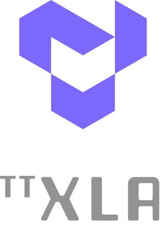

[![Tests][tests badge]][tests]
[![Codecov][codecov badge]][codecov]

<div align="center">

<h1>

[Hardware](https://tenstorrent.com/cards/) | [Documentation](docs/src) | [Discord](https://discord.gg/tenstorrent) | [Join Us](https://job-boards.greenhouse.io/tenstorrent?gh_src=22e462047us)

</h1>
<picture>
  
</picture>

</div>
<br>

tt-xla leverages a PJRT interface to integrate JAX (and in the future other frameworks), `tt-mlir` and Tenstorrent hardware. It supports ingestion of JAX models via jit compile, providing a StableHLO (SHLO) graph to `tt-mlir` compiler.

-----
# Quick Links
- [Getting Started / How to Run a Model](docs/src/getting_started.md)
### Wheel build
To build a wheel run:

```bash
cd python_packages
python setup.py bdist_wheel
```

this will output `python_packages/dist/pjrt_plugin_tt*.whl` file which is self-contained and can be installed using:

```bash
pip install pjrt_plugin_tt*.whl
```

Wheel has the following structure:

```bash
jax_plugins
`-- pjrt_plugin_tt
    |-- __init__.py
    |-- pjrt_plugin_tt.so   # Plugin itself.
    `-- tt-mlir             # Entire tt-mlir installation folder
        `-- install
            |-- include
            |   `-- ...
            |-- lib
            |   |-- libTTMLIRCompiler.so
            |   |-- libTTMLIRRuntime.so
            |   `-- ...
            `-- tt-metal    # We need to set TT_METAL_HOME to this dir when loading plugin
                |-- runtime
                |   `-- ...
                |-- tt_metal
                |   `-- ...
                `-- ttnn
                    `-- ...
```

It contains custom Tenstorrent PJRT plugin (an `.so` file), `__init__.py` file which holds recipe (a python function) to register PJRT plugin with JAX, and `tt-mlir` installation
dir which is needed to be able to dynamically link tt-mlir libs in runtime and to resolve various `tt-metal` dependencies without which plugin won't work.

Structuring wheel/folders this way allows JAX to automatically discover and register the plugin. User just needs to install the wheel and they will be able to see Tenstorrent devices from their program, for example:

```bash
pip install pjrt_plugin_tt*.whl
```

and then in python:

```python
import jax
tt_device = jax.devices("tt") # this will trigger plugin registration.
```

## Testing
tt-xla repo contains various tests in `tests` directory. To run them all, please run `pytest -v tests` from project root directory. To run individual test, `pytest -svv` is recommended in order to capture all potential error messages down the line.

-----
# What is this Repo?
The tt-xla repository is primarily used to enable running JAX models on Tenstorrent's AI hardware. It's a backend integration between the JAX ecosystem and Tenstorrent's ML accelerators using the PJRT (Portable JAX Runtime) interface.

-----
# Current AI Framework Front End Projects
- [tt-forge-fe](https://github.com/tenstorrent/tt-forge-fe)
  - A TVM based graph compiler designed to optimize and transform computational graphs for deep learning models. Supports ingestion of PyTorch, ONNX, TensorFlow, PaddlePaddle and similar ML frameworks via TVM ([tt-tvm](https://github.com/tenstorrent/tt-tvm)).
  - See [docs pages](https://docs.tenstorrent.com/tt-forge-fe/getting-started.html) for an overview and getting started guide.

- [tt-torch](https://github.com/tenstorrent/tt-torch)
  - A MLIR-native, open-source, PyTorch 2.X and torch-mlir based front-end. It provides stableHLO (SHLO) graphs to `tt-mlir`. Supports ingestion of PyTorch models via PT2.X compile and ONNX models via torch-mlir (ONNX->SHLO)
  - See [docs pages](https://docs.tenstorrent.com/tt-torch) for an overview and getting started guide.

- [tt-xla](https://github.com/tenstorrent/tt-xla)
  - Leverages a PJRT interface to integrate JAX (and in the future other frameworks), `tt-mlir` and Tenstorrent hardware. Supports ingestion of JAX models via jit compile, providing StableHLO (SHLO) graph to `tt-mlir` compiler
  - See [getting_started.md](docs/src/getting_started.md) for an overview and getting started guide.

-----
# Related Tenstorrent Projects
- [tt-forge](https://github.com/tenstorrent/tt-forge)
- [tt-forge-fe](https://github.com/tenstorrent/tt-forge-fe)
- [tt-torch](https://github.com/tenstorrent/tt-torch)
- [tt-mlir](https://github.com/tenstorrent/tt-mlir)
- [tt-metalium](https://github.com/tenstorrent/tt-metal)
- [tt-tvm](https://github.com/tenstorrent/tt-tvm)

-----
# Tenstorrent Bounty Program Terms and Conditions
This repo is a part of Tenstorrent’s bounty program. If you are interested in helping to improve tt-forge, please make sure to read the [Tenstorrent Bounty Program Terms and Conditions](https://docs.tenstorrent.com/bounty_terms.html) before heading to the issues tab. Look for the issues that are tagged with both “bounty” and difficulty level!

[codecov]: https://codecov.io/gh/tenstorrent/tt-xla
[tests]: https://github.com/tenstorrent/tt-xla/actions/workflows/on-push.yml?query=branch%3Amain
[codecov badge]: https://codecov.io/gh/tenstorrent/tt-xla/graph/badge.svg?token=XQJ3JVKIRI
[tests badge]: https://github.com/tenstorrent/tt-xla/actions/workflows/on-push.yml/badge.svg?query=branch%3Amain
