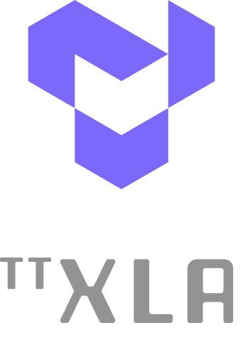

[![Tests][tests badge]][tests]
[![Codecov][codecov badge]][codecov]

<h1>

[Hardware](https://tenstorrent.com/cards/) | [Documentation](docs/src) | [Discord](https://discord.gg/tenstorrent) | [Join Us](https://job-boards.greenhouse.io/tenstorrent?gh_src=22e462047us)

</h1>
<picture>
  
</picture>

 

TT-XLA leverages a PJRT interface to integrate JAX (and in the future other frameworks), TT-MLIR and Tenstorrent hardware. It supports ingestion of JAX models via jit compile, providing a StableHLO (SHLO) graph to TT-MLIR compiler.

-----
# Quick Links
- [Getting Started / How to Run a Model](docs/src/getting_started.md)

-----
# What is This Repo?
The TT-XLA repository is primarily used to enable running JAX models on Tenstorrent's AI hardware. It's a backend integration between the JAX ecosystem and Tenstorrent's ML accelerators using the PJRT (Portable JAX Runtime) interface.

-----
# Current AI Framework Front End Projects
- [TT-XLA](https://github.com/tenstorrent/tt-xla)
  - TT-XLA is the primary frontend for running PyTorch and JAX models. It leverages a PJRT interface to integrate JAX (and in the future other frameworks), TT-MLIR, and Tenstorrent hardware. It supports ingestion of JAX models via jit compile, providing StableHLO (SHLO) graph to TT-MLIR compiler. TT-XLA can be used for single and multi-chip projects. 
  - See the [TT-XLA docs pages](https://docs.tenstorrent.com/tt-xla) for an overview and getting started guide.

- [TT-Forge-FE](https://github.com/tenstorrent/tt-forge-fe)
  - A TVM based graph compiler designed to optimize and transform computational graphs for deep learning models. Supports ingestion of ONNX, TensorFlow, PaddlePaddle and similar ML frameworks via TVM ([TT-TVM](https://github.com/tenstorrent/tt-tvm)). It also supports ingestion of PyTorch, however it is recommended that you use TT-XLA. TT-Forge-FE does not support multi-chip configurations; it is for single-chip projects only.
  - See the [TT-Forge-FE docs pages](https://docs.tenstorrent.com/tt-forge-fe/getting-started.html) for an overview and getting started guide.

- [TT-Torch](https://github.com/tenstorrent/tt-torch) - (deprecated)
  - A MLIR-native, open-source, PyTorch 2.X and Torch-MLIR based front-end. It provides stableHLO (SHLO) graphs to TT-MLIR. Supports ingestion of PyTorch models via PT2.X compile and ONNX models via torch-mlir (ONNX->SHLO)
  - See the [TT-Torch docs pages](https://docs.tenstorrent.com/tt-torch) for an overview and getting started guide.

-----
# Related Tenstorrent Projects
- [TT-XLA](https://github.com/tenstorrent/tt-xla) - (single and multi-chip) For use with PyTorch, JAX, and TensorFlow 
- [TT-Forge-FE](https://github.com/tenstorrent/tt-forge-fe) - (single chip only) For use with ONNX and PaddlePaddle, it also runs PyTorch, however it is recommended to use TT-XLA for PyTorch 
- [TT-MLIR](https://github.com/tenstorrent/tt-mlir) - Open source compiler framework for compiling and optimizing machine learning models for Tenstorrent hardware
- [TT-Metal](https://github.com/tenstorrent/tt-metal) - Low-level programming model, enabling kernel development for Tenstorrent hardware
- [TT-TVM](https://github.com/tenstorrent/tt-tvm) - A compiler stack for deep learning systems designed to close the gap between the productivity-focused deep learning frameworks, and the performance and efficiency-focused hardware backends
- [TT-Torch](https://github.com/tenstorrent/tt-torch) - (Deprecated) Previously for use with PyTorch. It is recommended that you use TT-XLA for PyTorch. 

-----
# Tenstorrent Bounty Program Terms and Conditions
This repo is a part of Tenstorrent’s bounty program. If you are interested in helping to improve tt-forge, please make sure to read the [Tenstorrent Bounty Program Terms and Conditions](https://docs.tenstorrent.com/bounty_terms.html) before heading to the issues tab. Look for the issues that are tagged with both “bounty” and difficulty level!

[codecov]: https://codecov.io/gh/tenstorrent/tt-xla
[tests]: https://github.com/tenstorrent/tt-xla/actions/workflows/on-push.yml?query=branch%3Amain
[codecov badge]: https://codecov.io/gh/tenstorrent/tt-xla/graph/badge.svg?token=XQJ3JVKIRI
[tests badge]: https://github.com/tenstorrent/tt-xla/actions/workflows/on-push.yml/badge.svg?query=branch%3Amain
[deepwiki]: https://deepwiki.com/tenstorrent/tt-xla
[deepwiki badge]: https://deepwiki.com/badge.svg
