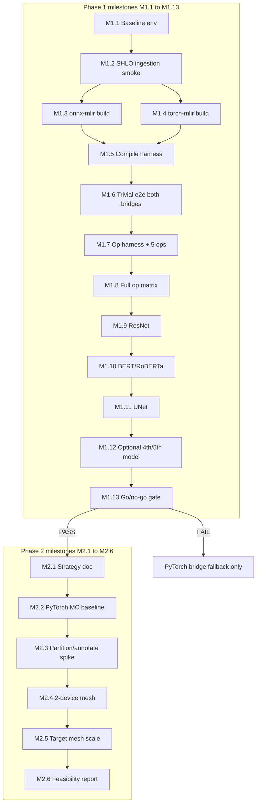

# ONNX on TT-XLA — Sequential Milestones (Phase 1 & Phase 2)

This document breaks the agreed ONNX plan into **small, sequential milestones**. Complete each milestone in order; do not skip ahead unless exit criteria for the prior milestone are met (or explicitly waived with documented risk).

**Parent plan:** [onnx_support_options.md](onnx_support_options.md)

---

## End goal cross-check

What we are ultimately building, and what Phase 1 / Phase 2 actually prove:

| North-star goal | Phase 1 proves | Phase 2 proves | Explicitly out of scope until later |
|-----------------|----------------|----------------|-------------------------------------|
| ONNX models run on TT hardware via tt-xla (not Forge/TVM) | Yes — 3–5 models e2e single chip | Partial — 1 model on mesh | Full opset / arbitrary third-party ONNX |
| Reliable path: ONNX → SHLO → PJRT → TTNN → device | Yes — one chosen bridge | Same path + sharding/partition | ORT EP, production wheel (Phase 5) |
| Compare onnx-mlir vs torch-mlir with data | Yes — op matrix + models | N/A (use Phase 1 winner only) | Maintaining both bridges forever |
| Multi-chip ONNX | No (single chip only) | Feasibility only — not product | Parity with JAX `shard_map` / torch_xla SPMD |
| Performance parity with PyTorch composites | No | No | SHLO composite passes (Phase 5) |
| Production CI / `test_models` integration | No | No | Phase 5 |

**Phase 1 success = Tier A production candidate:** curated ONNX models, documented op matrix, single-chip, go/no-go **PASS**.  
**Phase 2 success = informed decision:** multi-chip ONNX is feasible via strategy X with documented drawbacks — not full multi-chip product.

---

## Dependency overview



---

# Phase 1 — Single-chip ONNX (milestones M1.1 → M1.13)

**Target duration (realistic, Cursor-assisted):** 8–12 weeks  
**End deliverable:** ≥3/5 models e2e, bridge winner, go/no-go report

---

### M1.1 — Baseline environment verified

**Goal:** Confirm tt-xla runs PyTorch/JAX on your TT device before any ONNX work.

| Item | Detail |
|------|--------|
| **Prerequisites** | TT hardware, `pjrt-plugin-tt` wheel or local build |
| **Tasks** | Run `examples/pytorch/mnist.py` or equivalent; run one JAX op test; save system descriptor (`ttrt query --save-artifacts` if needed) |
| **Exit criteria** | [ ] MNIST or tiny model executes on TT device [ ] PJRT plugin loads without env errors [ ] IR dump path works (`--dump-irs` or compile options) |
| **Effort** | 2–5 days |
| **End-goal link** | Validates backend (PJRT path) independent of ONNX — if this fails, ONNX work is blocked |

---

### M1.2 — SHLO ingestion smoke (VHLO gate)

**Goal:** Prove tt-xla `ModuleBuilder` accepts MLIR from a non-XLA source (or document required fix).

| Item | Detail |
|------|--------|
| **Prerequisites** | M1.1 |
| **Tasks** | Take existing dumped `shlo*.mlir` from a PyTorch model run; attempt compile-only via PJRT or op-by-op path; if fail, implement **direct StableHLO ingestion** or VHLO wrap in `tt-xla/pjrt_implementation/src/api/module_builder/module_builder.cc` |
| **Exit criteria** | [ ] Hand-fed StableHLO/VHLO MLIR compiles to flatbuffer [ ] Document which path used (direct SHLO vs VHLO wrap) |
| **Effort** | 3 days – 2 weeks |
| **End-goal link** | **Critical gate** — ONNX bridges emit SHLO, not XLA VHLO |

---

### M1.3 — onnx-mlir built and MLIR-aligned with tt-mlir

**Goal:** Working `onnx-mlir` (or `onnx-mlir-opt`) that can emit StableHLO for a trivial graph.

| Item | Detail |
|------|--------|
| **Prerequisites** | M1.2 (know target MLIR revision from tt-mlir submodule) |
| **Tasks** | Pin tt-mlir LLVM/MLIR commit; build onnx-mlir against it; run `--convert-onnx-to-stablehlo` on tiny `Add` ONNX; save output `.mlir` |
| **Exit criteria** | [ ] `onnx-mlir-opt` runs without crash on 1-op Add model [ ] Output file parses as MLIR with `stablehlo` ops |
| **Effort** | 1–3 weeks |
| **End-goal link** | Bridge A for comparison |

---

### M1.4 — torch-mlir ONNX import built and aligned

**Goal:** Working torch-mlir ONNX → Torch → StableHLO path for same trivial graph.

| Item | Detail |
|------|--------|
| **Prerequisites** | M1.2 (can run in parallel with M1.3 after M1.2 done) |
| **Tasks** | Build torch-mlir at compatible MLIR pin; import tiny ONNX; run `convert-torch-onnx-to-torch` + lowering to SHLO |
| **Exit criteria** | [ ] Same Add model produces SHLO MLIR [ ] Document two-hop pipeline commands |
| **Effort** | 1–3 weeks |
| **End-goal link** | Bridge B for comparison |

---

### M1.5 — Minimal ONNX compile harness (`tt_onnx` spike)

**Goal:** One script/API: `onnx_path + bridge → compile → LoadedExecutable → run`.

| Item | Detail |
|------|--------|
| **Prerequisites** | M1.2, M1.3 **or** M1.4 (at least one bridge) |
| **Tasks** | Create `python_package/tt_onnx/` or `tools/onnx_spike/` with: load ONNX, call bridge CLI, feed MLIR to PJRT (via minimal XLA client or direct binding), run with numpy/torch inputs, return outputs |
| **Exit criteria** | [x] Single command compiles and runs Add ONNX on device [x] Logs saved: bridge used, SHLO dump, compile time |
| **Effort** | 3 days – 2 weeks |
| **End-goal link** | Reusable harness for all following milestones |

---

### M1.6 — Trivial e2e on both bridges

**Goal:** Same tiny model (Add, then 2-layer MLP) passes on **both** onnx-mlir and torch-mlir through harness.

| Item | Detail |
|------|--------|
| **Prerequisites** | M1.3, M1.4, M1.5 |
| **Tasks** | Create/export tiny MLP ONNX; run both bridges; compare output vs ONNX Runtime CPU reference (PCC or max abs diff) |
| **Exit criteria** | [ ] Add + MLP e2e on device for **both** bridges [ ] Numerical match within tolerance |
| **Effort** | 3–5 days |
| **End-goal link** | Proves full pipeline ONNX → device for both candidates |

---

### M1.7 — Op matrix harness + first 5 ops

**Goal:** Automated op-level runner; seed with 5 high-priority ops.

| Item | Detail |
|------|--------|
| **Prerequisites** | M1.6 |
| **Tasks** | Script: generate or check in single-op ONNX files; for each op × bridge: lower → compile → execute → pass/fail; integrate with `tt-xla/tests/op_by_op/` patterns where possible |
| **Seed ops** | Add, Mul, MatMul, Relu, Reshape |
| **Exit criteria** | [ ] Runner produces JSON/CSV row per op [ ] 5 ops scored for both bridges |
| **Effort** | 1 week |
| **End-goal link** | Scaling signal before expensive model work |

---

### M1.8 — Full basic op matrix + provisional bridge winner

**Goal:** Complete ~15–20 op matrix; pick provisional winner.

| Item | Detail |
|------|--------|
| **Prerequisites** | M1.7 |
| **Tasks** | Add: Sub, Div, Sigmoid, ReduceMean, ReduceSum, Transpose, Concat, Slice, Conv (3x3), LayerNormalization (or decomposed), Softmax, Gather |
| **Exit criteria** | [ ] Full matrix completed [ ] Pass-rate % per bridge calculated [ ] **Provisional winner** declared if one bridge ≥10–15% higher pass rate [ ] Failed ops logged with failure stage (ONNX→SHLO / SHLO→TTNN / execute) |
| **Effort** | 1–2 weeks |
| **End-goal link** | Data-driven bridge choice before model investment |

**Decision rule:** If one bridge wins clearly, use it for M1.9–M1.12 only (run loser on 3 seed models for regression record).

---

### M1.9 — Model 1: ResNet e2e

**Goal:** First real CV model end-to-end on device.

| Item | Detail |
|------|--------|
| **Prerequisites** | M1.8 |
| **Tasks** | Use `tt-xla/third_party/tt_forge_models/resnet/.../onnx/loader.py` or export ResNet-18 ONNX; run via harness; PCC vs ORT CPU |
| **Exit criteria** | [ ] ONNX→SHLO succeeds [ ] PJRT compile succeeds [ ] E2E execute on single chip [ ] PCC ≥ 0.99 (or project standard) [ ] SHLO op count + failure ops documented |
| **Effort** | 3–7 days (up to 2 weeks if tt-mlir gaps) |
| **End-goal link** | First of ≥3 required models |

---

### M1.10 — Model 2: RoBERTa / BERT-base e2e

**Goal:** NLP model with MatMul, LayerNorm, attention decomposition.

| Item | Detail |
|------|--------|
| **Prerequisites** | M1.9 (learnings applied) |
| **Tasks** | Load via `tt_forge_models` RoBERTa/BERT ONNX loader; same harness + PCC |
| **Exit criteria** | Same as M1.9 |
| **Effort** | 5–10 days (attention/LayerNorm often expose bridge + tt-mlir gaps) |
| **End-goal link** | Second of ≥3; stress-tests scaling of primitive ops |

---

### M1.11 — Model 3: UNet e2e

**Goal:** Segmentation model — conv, upsample, skip connections.

| Item | Detail |
|------|--------|
| **Prerequisites** | M1.10 |
| **Tasks** | UNet ONNX from `tt_forge_models`; harness + PCC |
| **Exit criteria** | Same as M1.9 |
| **Effort** | 5–10 days |
| **End-goal link** | Third of ≥3 — **minimum bar for go/no-go PASS** |

---

### M1.12 — Optional models 4–5 (VGG / MobileNet + stretch)

**Goal:** Broaden coverage; optional for go/no-go if M1.9–M1.11 pass.

| Item | Detail |
|------|--------|
| **Prerequisites** | M1.11 |
| **Tasks** | **M1.12a:** VGG-11 or MobileNet (second CV stack) — **recommended** [ ] **M1.12b:** T5-small or Whisper-tiny — stretch (dynamic/control-flow risk) |
| **Exit criteria** | [ ] At least one of 4/5 passes e2e OR documented skip with reason |
| **Effort** | 3–7 days each |
| **End-goal link** | Strengthens confidence; 5/5 not required for PASS |

---

### M1.13 — Phase 1 go / no-go gate (decision milestone)

**Goal:** Formal decision to invest in production (Phase 5) and/or Phase 2 multi-chip.

| Item | Detail |
|------|--------|
| **Prerequisites** | M1.11 minimum; M1.12 recommended |
| **Tasks** | Write report: bridge winner + rationale; op matrix summary; per-model status table; bounded op-gap backlog; recommended next steps |
| **Exit criteria — PASS** | [ ] ≥3 models e2e single chip [ ] Winner bridge identified [ ] Op gap list bounded (<20 blocking ops or clear owners) [ ] VHLO/SHLO path stable (no per-model hacks) |
| **Exit criteria — FAIL** | Document fallback: Option 2 (ONNX→PyTorch→tt) for blocked models; do **not** start Phase 2 until PASS or explicit waiver |
| **Effort** | 2–5 days |
| **End-goal link** | **Phase 1 complete** — Tier A production candidate validated |

---

## Phase 1 milestone summary

| ID | Milestone | Effort (realistic) | Gate? |
|----|-----------|-------------------|-------|
| M1.1 | Baseline env | 2–5 days | Yes |
| M1.2 | SHLO ingestion smoke | 3 days – 2 wk | **Hard gate** |
| M1.3 | onnx-mlir build | 1–3 wk | Yes |
| M1.4 | torch-mlir build | 1–3 wk | Yes |
| M1.5 | Compile harness | 3 days – 2 wk | Yes |
| M1.6 | Trivial e2e both bridges | 3–5 days | Yes |
| M1.7 | Op harness + 5 ops | 1 wk | Yes |
| M1.8 | Full op matrix + winner | 1–2 wk | **Decision** |
| M1.9 | ResNet | 3–7 days | — |
| M1.10 | BERT/RoBERTa | 5–10 days | — |
| M1.11 | UNet | 5–10 days | **Minimum 3 models** |
| M1.12 | Optional 4th/5th model | 3–7 days each | Optional |
| M1.13 | Go/no-go gate | 2–5 days | **Phase 1 exit** |

---

# Phase 2 — Multi-chip feasibility (milestones M2.1 → M2.6)

**Prerequisites:** M1.13 **PASS**  
**Target duration (realistic):** 5–8 weeks  
**End deliverable:** Feasibility report + 1 ONNX model demo on multi-device mesh

---

### M2.1 — Multi-chip strategy selection

**Goal:** Choose one approach before coding (avoid trying all at once).

| Item | Detail |
|------|--------|
| **Prerequisites** | M1.13 PASS; at least one stable single-chip model (prefer ResNet for simplicity) |
| **Tasks** | Compare: **(A)** graph partition → N single-chip executables (vLLM pattern) vs **(B)** manual GSPMD/Shardy on imported SHLO; write 1-page decision with effort/risk |
| **Exit criteria** | [ ] Strategy A or B selected [ ] Target mesh shape defined (e.g. 1×2, 2×2) [ ] Success metrics defined |
| **Effort** | 2–5 days |
| **End-goal link** | Scoped Phase 2 — prevents open-ended sharding research |

**Recommendation:** Start with **(A) partition** for ResNet (data parallel split) — lower risk than full SHLO sharding annotations.

---

### M2.2 — Reference multi-chip baseline captured

**Goal:** Know what “good” looks like from existing tt-xla PyTorch/JAX multi-chip.

| Item | Detail |
|------|--------|
| **Prerequisites** | M2.1 |
| **Tasks** | Run one existing multi-chip test (e.g. JAX `shard_map` test or torch multi-host) on same mesh; capture IR shardings, compile options, perf note |
| **Exit criteria** | [ ] Reference log + IR dump saved [ ] Shardy/GSPMD attributes documented as template |
| **Effort** | 3–5 days |
| **End-goal link** | Benchmark for Phase 2 ONNX behavior vs native frameworks |

---

### M2.3 — Implement spike for chosen strategy (single-chip model)

**Goal:** Adapt Phase 1 winner model for multi-chip strategy in code.

| Item | Detail |
|------|--------|
| **Prerequisites** | M2.1, M2.2 |
| **Tasks** | **If (A):** split graph or replicate+allreduce pattern in Python orchestration **If (B):** post-process SHLO with sharding annotations for one partitionable dim |
| **Exit criteria** | [ ] Design implemented in spike branch [ ] Compile succeeds per partition/device on paper / dry-run |
| **Effort** | 1–2 weeks |
| **End-goal link** | Bridge from single-chip ONNX to mesh execution |

---

### M2.4 — 2-device mesh compile + execute

**Goal:** Smallest multi-device proof.

| Item | Detail |
|------|--------|
| **Prerequisites** | M2.3 |
| **Tasks** | Run on 2-device mesh; verify outputs match single-chip or expected sharded semantics |
| **Exit criteria** | [ ] 2-device e2e pass [ ] No hang/timeout on fabric init [ ] Failure modes documented |
| **Effort** | 1–2 weeks |
| **End-goal link** | First multi-device ONNX datapoint |

---

### M2.5 — Scale to target mesh (4+ devices)

**Goal:** Validate strategy at modest scale.

| Item | Detail |
|------|--------|
| **Prerequisites** | M2.4 |
| **Tasks** | Scale to agreed mesh (e.g. 2×2); measure compile time, execute correctness, basic perf vs 1 chip |
| **Exit criteria** | [ ] Target mesh e2e pass OR clear blocker filed [ ] Perf note (even if bad) |
| **Effort** | 1–2 weeks |
| **End-goal link** | Answers “does multi-chip ONNX scale at all?” |

---

### M2.6 — Phase 2 feasibility report (exit milestone)

**Goal:** Decision input for Phase 5 / product roadmap — not a ship gate.

| Item | Detail |
|------|--------|
| **Prerequisites** | M2.4 minimum; M2.5 recommended |
| **Tasks** | Document: strategy used, device count achieved, drawbacks vs PyTorch SPMD, recommended product path (partition-only vs invest in SHLO sharding), estimate for production multi-chip |
| **Exit criteria** | [ ] Written report reviewed [ ] Explicit recommendation: pursue / defer / partition-only [ ] Known blockers with owners |
| **Effort** | 3–5 days |
| **End-goal link** | **Phase 2 complete** — multi-chip ONNX feasibility answered |

---

## Phase 2 milestone summary

| ID | Milestone | Effort (realistic) | Gate? |
|----|-----------|-------------------|-------|
| M2.1 | Strategy selection | 2–5 days | Yes |
| M2.2 | PyTorch/JAX MC baseline | 3–5 days | Yes |
| M2.3 | Spike implementation | 1–2 wk | Yes |
| M2.4 | 2-device mesh e2e | 1–2 wk | **Minimum bar** |
| M2.5 | Target mesh scale | 1–2 wk | Recommended |
| M2.6 | Feasibility report | 3–5 days | **Phase 2 exit** |

---

## Cross-check: milestone → end goal

| End-goal requirement | Satisfied by |
|----------------------|--------------|
| ONNX reaches tt-xla PJRT backend | M1.2, M1.5, M1.6 |
| onnx-mlir vs torch-mlir comparison | M1.6–M1.8, M1.13 |
| Basic op scaling understood | M1.7, M1.8 |
| 3–5 sample models single chip | M1.9–M1.12 (≥3 required) |
| Production go/no-go | M1.13 |
| Multi-chip feasibility | M2.4–M2.6 |
| Production wheel / CI / composites | **Not in this doc** — Phase 5 after M1.13 PASS |

---

## Rules of engagement

1. **Sequential by default** — M1.x before M1.x+1; M2 only after M1.13 PASS.
2. **Hard gates** — M1.2 (SHLO ingestion), M1.11 (3rd model), M1.13 (go/no-go), M2.4 (2-device).
3. **Stop and reassess** if M1.8 shows both bridges <50% op pass rate — fix toolchain before models.
4. **One bridge after M1.8** — do not dual-maintain unless loser run on 3 models for record.
5. **Cursor usage** — best on M1.5–M1.8, M1.9–M1.12 test code; expect manual time on M1.2–M1.4.

---

## Quick reference: what to do next

If starting from zero:

```
M1.1 → M1.2 → (M1.3 ∥ M1.4) → M1.5 → M1.6 → M1.7 → M1.8 → M1.9 → M1.10 → M1.11 → [M1.12] → M1.13
                                                                                              ↓ PASS
                                                                    M2.1 → M2.2 → M2.3 → M2.4 → [M2.5] → M2.6
```
