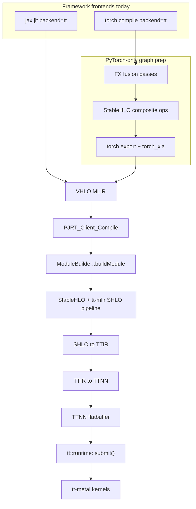
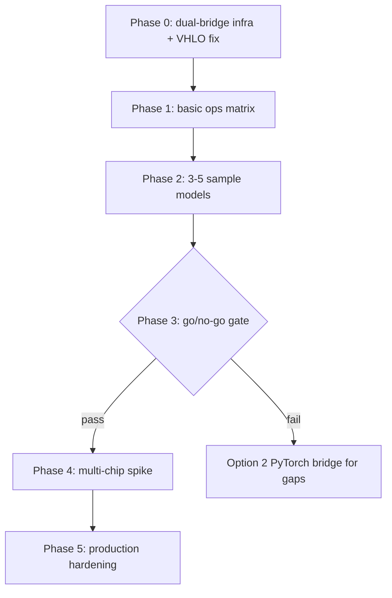
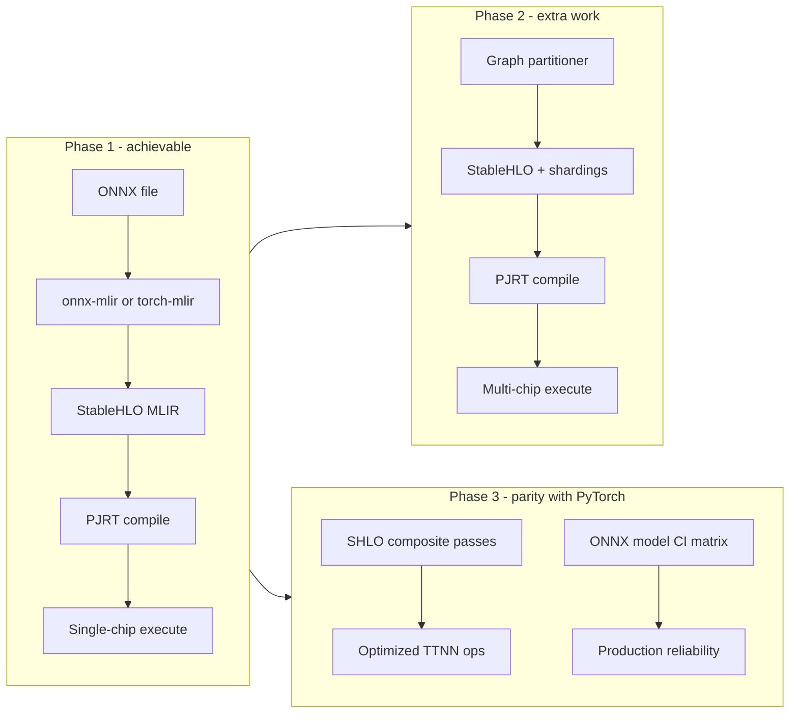

ONNX Support Options for TT-XLA

## Current architecture (what ONNX must plug into)

TT-XLA is **not** a monolithic “model runner.” It is a **PJRT plugin** (`[pjrt_plugin_tt.so](tt-xla/python_package/pjrt_plugin_tt/__init__.py)`) that accepts **MLIR programs in VHLO/StableHLO form** and lowers them to TT hardware.

**Compile entry (framework-agnostic):** `[PJRT_Client_Compile](tt-xla/pjrt_implementation/src/api/client_instance.cc)` accepts only `format == "mlir"` and calls `compileMlirProgram()` → `[ModuleBuilder::buildModule](tt-xla/pjrt_implementation/src/api/module_builder/module_builder.cc)`:

1. VHLO → StableHLO
2. tt-xla frontend SHLO passes (input roles, Shardy mesh, XLA cleanup)
3. tt-mlir `createStableHLOPipeline`
4. SHLO → TTIR → TTNN → flatbuffer (or codegen via TT-Alchemist)
5. Execute via `[flatbuffer_loaded_executable_instance.cc](tt-xla/pjrt_implementation/src/api/flatbuffer_loaded_executable_instance.cc)` → `tt::runtime::submit()`

**PyTorch-specific value (ONNX would not get by default):** Before XLA, `[torch_pass_pipeline](tt-xla/python_package/tt_torch/backend/backend.py)` runs FX **fusion** and **composite op wrapping** (`tenstorrent.rms_norm`, `tenstorrent.gelu`, etc.) documented in `[fusing_and_composite_ops.md](tt-xla/docs/src/fusing_and_composite_ops.md)`. These composites map to optimized TTIR/TTNN ops in tt-mlir. Raw ONNX→StableHLO typically decomposes into many primitive `stablehlo.`* ops unless you add equivalent composite legalization passes.

**Multi-model support (same for all frontends):** There is no special “multi-model runtime.” Production patterns already used in-repo:

- One `LoadedExecutable` per compiled graph (vLLM splits LLM into multiple `torch.compile` subgraphs in `[model_runner.py](tt-xla/integrations/vllm_plugin/vllm_tt/model_runner.py)`)  
- `export_model_name` + `_g{N}` suffix per graph in `ModuleBuilder` for benchmark/model catalogs  
- `[tt_forge_models](tt-xla/third_party/tt_forge_models/)` catalog with `Framework.ONNX` loaders that **export PyTorch→ONNX for TT-Forge-ONNX**, not for tt-xla execution

**ONNX in this repo today:** README explicitly points ONNX users to **[TT-Forge-ONNX](https://github.com/tenstorrent/tt-forge-onnx)** (TVM stack, **single-chip only**). Deprecated **[TT-Torch](https://github.com/tenstorrent/tt-torch)** historically did `ONNX → SHLO` via torch-mlir. No ONNX code exists under `[pjrt_implementation/](tt-xla/pjrt_implementation/)` or main tests.

**Implication:** ONNX integration is feasible **if you can reliably produce StableHLO MLIR** that passes the same SHLO→TTIR→TTNN path. The hard part is the **frontend + op coverage + performance composites + multi-chip shardings**, not the PJRT backend.

---

## Option 1 — Native ONNX frontend: ONNX → StableHLO → PJRT (recommended long-term for tt-xla parity)

**Approach:** Add a new package (e.g. `onnx_plugin_tt` or `tt_onnx`) that:

1. Loads `.onnx` / ONNX Runtime session
2. Lowers to StableHLO MLIR (via **onnx-mlir** and/or **torch-mlir ONNX import**, the path TT-Torch used)
3. Invokes PJRT compile + execute (Python PJRT bindings, or a thin C API wrapper around existing plugin)

**Pros**

- Aligns with README’s stated direction (“in the future other frameworks”) and single backend (tt-mlir + PJRT)  
- Reuses full tt-xla stack: multi-chip if shardings are present in MLIR (GSPMD/Shardy), same CI/op-by-op tooling (`[tests/op_by_op/](tt-xla/tests/op_by_op/)`)  
- Multiple models = multiple executables, same as PyTorch/JAX  
- Avoids maintaining a second compiler (TVM/Forge) for ONNX on multi-chip

**Cons**

- **Largest engineering effort:** onnx-mlir op coverage, dynamic shapes, control flow, custom ONNX ops  
- **No automatic composite ops** unless you add SHLO-level pattern passes (mirror `tenstorrent.`* composites) or ONNX→Torch→composites bridge  
- **Multi-chip:** JAX/torch_xla inject GSPMD/Shardy metadata; raw ONNX→SHLO is usually single-device unless you add a partitioning story (manual annotations, or ONNX→JAX/torch SPMD first)  
- Must build/version-pin onnx-mlir / torch-mlir in the same MLIR ecosystem as tt-mlir  
- **VHLO ingestion:** ModuleBuilder today expects XLA-style VHLO then deserialize-to-SHLO; ONNX bridges emitting raw StableHLO may need a new compile entry or VHLO wrap pass  
- Production maturity requires a large ONNX op test matrix (similar to `[tests/runner/test_models.py](tt-xla/tests/runner/test_models.py)` but for ONNX)

**Production viability:** **High** for the **backend** (already production path for PyTorch/JAX). **Medium–high** for the **frontend** only after substantial op coverage and CI; this is a multi-quarter effort, not a small PR.

---

## Option 2 — Bridge: ONNX → PyTorch → `torch.compile(backend="tt")`

**Approach:** Use `onnx2torch`, ORT torch backend, or rehydrate ONNX as `nn.Module`, then existing `[tt_torch](tt-xla/python_package/tt_torch/)` pipeline (fusion + composites + torch_xla → PJRT).

**Pros**

- **Fastest path to “run ONNX on tt-xla hardware”** with minimal new C++/MLIR code  
- Inherits **fusion + composite ops** and most PyTorch model infra (weight dtype overrides, vLLM-style splitting)  
- Multi-chip possible where torch_xla SPMD / sharding is already used  
- Fits existing examples and wheels (`pjrt-plugin-tt` + `tt_torch`)

**Cons**

- **Not true ONNX execution** — conversion fidelity risk (unsupported ops, dtype/layout differences)  
- Two conversion steps (ONNX→Torch→SHLO) = harder debugging vs native ONNX  
- Dynamic ONNX models may not map cleanly to `torch.export`  
- Some ONNX models (heavy custom ops, NMS variants, etc.) fail at bridge layer before reaching TT  
- Operational confusion: users think they’re on “ONNX support” but opset/custom ops depend on PyTorch

**Production viability:** **Medium** — good for **known, static CV/NLP models** already representable in PyTorch; **weak** for arbitrary ONNX from third parties or frequent opset updates.

---

## Option 3 — Keep TT-Forge-ONNX as the ONNX product (status quo)

**Approach:** No tt-xla integration; continue using [TT-Forge-ONNX](https://github.com/tenstorrent/tt-forge-onnx) + TVM ([TT-TVM](https://github.com/tenstorrent/tt-tvm)) for ONNX/Paddle/etc.

**Pros**

- **Exists today** with ONNX-focused docs and workflows  
- `[tt_forge_models](tt-xla/third_party/tt_forge_models/)` ONNX loaders already target this path (`export_torch_model_to_onnx`)  
- Isolated failure domain from tt-xla PJRT releases

**Cons**

- **Single-chip only** (documented limitation) — not comparable to tt-xla multi-chip / distributed (`[tests/jax/multi_chip/](tt-xla/tests/jax/multi_chip/)`, `[tests/torch/multi_host/](tt-xla/tests/torch/multi_host/)`)  
- **Different compiler stack** (TVM vs tt-mlir PJRT) → duplicate op support, perf tuning, CI  
- Does not satisfy “ONNX like PyTorch/JAX on current repo/stack” in one product

**Production viability:** **High for single-chip ONNX deployment**; **not** a substitute for tt-xla-scale multi-chip ONNX.

---

## Option 4 — ONNX Runtime Execution Provider (ORT EP) wrapping PJRT

**Approach:** Implement an ORT EP that compiles ONNX subgraphs to TT flatbuffer via PJRT and executes with `tt::runtime`.

**Pros**

- Standard deployment interface for ONNX in production (many enterprises ship ORT + EP)  
- Natural **multi-model**: one ORT session per model, EP compiles per graph partition  
- Clear separation: ORT handles ONNX parsing/scheduling; TT handles kernels

**Cons**

- Heavy integration (ORT EP API, memory ownership, async, IO binding, dynamic shapes)  
- Partitioning/fallback to CPU for unsupported ops  
- Still need ONNX→SHLO (or ORT→MLIR) per partition — same op coverage problem as Option 1  
- Tenstorrent would maintain ORT version compatibility

**Production viability:** **High** for **serving fixed ONNX models** once op coverage is sufficient; **high upfront** cost.

---

## Option 5 — AOT artifact path: offline ONNX → StableHLO MLIR → runtime loader

**Approach:** Offline compiler CLI (onnx-mlir + tt-xla frontend) produces flatbuffer + metadata; lightweight Python/C++ runtime loads and runs without JAX/PyTorch at inference time (similar spirit to `[codegen](tt-xla/docs/src/getting_started_codegen.md)` / compile-only modes).

**Pros**

- Best for **fixed production models** (edge, datacenter inference)  
- Smallest inference dependency footprint  
- Reuses `ModuleBuilder` and flatbuffer execution unchanged  
- Multiple models = ship multiple artifacts + simple loader registry

**Cons**

- No eager/debug framework loop; recompile on graph or shape change  
- Dynamic shapes require explicit dimension specialization or recompilation  
- Still requires Option 1’s ONNX→SHLO toolchain in build pipeline

**Production viability:** **High** for **AOT deployment** of known models; not a full “ONNX framework” experience.

---

## Option 6 — Revive / port TT-Torch ONNX path into tt-xla

**Approach:** Port deprecated [TT-Torch](https://github.com/tenstorrent/tt-torch) ONNX→SHLO (torch-mlir) pipeline into tt-xla as `tt_onnx`, then PJRT.

**Pros**

- Proven Tenstorrent direction (README references ONNX→SHLO via torch-mlir)  
- Faster than greenfield onnx-mlir if TT-Torch code is still usable  
- Lands directly on tt-xla’s SHLO ingestion point

**Cons**

- TT-Torch is **deprecated** — may bitrot against current tt-mlir/torch-mlir versions  
- torch-mlir ONNX import maintenance burden  
- Same composite-op and sharding gaps as Option 1 unless ported passes are included

**Production viability:** **Medium–high** if port is actively maintained; **low** if treated as unmigrated legacy.

---

## Comparative summary

| Option                  | Fits tt-xla stack | Multi-chip           | Multi-model | Time to first model | Production grade        |
| ----------------------- | ----------------- | -------------------- | ----------- | ------------------- | ----------------------- |
| 1 Native ONNX→SHLO→PJRT | Yes               | Yes (with shardings) | Yes         | Long                | High (after investment) |
| 2 ONNX→PyTorch→tt       | Yes               | Partial              | Yes         | Short               | Medium                  |
| 3 TT-Forge-ONNX         | No (TVM)          | No                   | Yes         | Short (today)       | High single-chip        |
| 4 ORT EP                | Yes               | Yes                  | Yes         | Long                | High serving            |
| 5 AOT MLIR/flatbuffer   | Yes               | Yes                  | Yes         | Medium              | High fixed models       |
| 6 Port TT-Torch         | Yes               | Yes                  | Yes         | Medium              | Medium–high             |

---

## Feasibility verdict

**Can ONNX be integrated into tt-xla reliably at production level with multiple models?**

- **Backend:** Yes. PJRT + ModuleBuilder + flatbuffer runtime are **framework-agnostic** once StableHLO is valid. Multi-model is already proven (per-graph executables, vLLM subgraphs, model catalog tests).  
- **Full parity with PyTorch/JAX:** Only with **Option 1 / 5 / 6** (native SHLO ingestion). Option 2 is a pragmatic shortcut with conversion risk.  
- **Multi-chip ONNX:** Feasible on tt-xla **only if** the ONNX frontend produces shardings (GSPMD/Shardy) or models are single-device. TT-Forge-ONNX does not solve multi-chip today.  
- **Performance parity:** Expect **gap vs PyTorch** until SHLO composites / tt-mlir fusion patterns exist for ONNX-lowered graphs (LayerNorm, GELU, attention, etc.).

**Recommended strategy (phased)** — **UPDATED: agreed execution plan**

This replaces the earlier generic phasing. **Proceed this way** — it is the right de-risking sequence for production-level ONNX on tt-xla.

---

## Agreed execution plan (Phase 0 → 5)

**Sequential milestones (recommended tracking doc):** [onnx_integration_milestones.md](onnx_integration_milestones.md) — M1.1→M1.13 (Phase 1 single-chip) then M2.1→M2.6 (Phase 2 multi-chip), each with exit criteria cross-checked to the end goal.

### Phase 0 — Spike infrastructure (both bridges in parallel)

Build minimal `tt_onnx` tooling (scripts or thin package, not full product yet):

1. Load `.onnx` file
2. **Path A:** onnx-mlir → StableHLO MLIR (`--convert-onnx-to-stablehlo` or equivalent pipeline)
3. **Path B:** torch-mlir ONNX importer → `convert-torch-onnx-to-torch` → StableHLO
4. Feed MLIR into tt-xla PJRT (`ModuleBuilder` path)
5. **Resolve VHLO gate early** — add direct-SHLO ingestion or VHLO wrap; do not defer

**Exit criteria:** At least one trivial model (e.g. single `Add` or tiny MLP) compiles and executes on single TT device via both paths.

### Phase 1 — Basic ops (scaling signal before full models)

Use ONNX op snippets or single-op `.onnx` files covering a **core op set** aligned with tt-xla op-by-op coverage:

- Elementwise: Add, Mul, Sub, Div, Relu, Sigmoid
- Reduction: ReduceMean, ReduceSum
- Shape: Reshape, Transpose, Concat, Slice
- Compute: MatMul, Conv (basic)
- Norm-ish: LayerNormalization or decomposed Norm+Mul+Add

For **each op × each bridge**, record:

| Metric                        | Purpose                                           |
| ----------------------------- | ------------------------------------------------- |
| ONNX→SHLO lowers?             | Bridge op coverage                                |
| SHLO→TTIR→TTNN compiles?      | tt-mlir gap                                       |
| Executes with correct output? | Runtime gap                                       |
| IR size / op count            | Scaling proxy (primitive explosion vs composites) |

Reuse `[tests/op_by_op/](tt-xla/tests/op_by_op/)` workflow on dumped SHLO IR from each bridge.

**Exit criteria:** Quantitative comparison — e.g. "% ops that compile+execute end-to-end" per bridge. **Pick provisional winner** if one bridge is clearly ahead (>10–15% op pass rate or fewer manual fixes).

### Phase 2 — Sample models (3–5 end-to-end)

Run **the same models through both bridges** (apples-to-apples). Suggested set from existing `[tt_forge_models](tt-xla/third_party/tt_forge_models/)` ONNX loaders:

| Model                                   | Task                        | Why                                        |
| --------------------------------------- | --------------------------- | ------------------------------------------ |
| ResNet-18/50                            | Image classification        | Standard CV, well-understood ops           |
| RoBERTa / BERT-base                     | NLP sequence classification | MatMul, LayerNorm, attention patterns      |
| UNet                                    | Segmentation                | Conv + upsample + skip connections         |
| VGG-11 or MobileNet                     | Second CV baseline          | Different conv stack                       |
| (Optional 5th) Whisper-tiny or T5-small | Seq2seq / audio             | Stretch goal for dynamic/control-flow risk |

Per model, per bridge, measure:

- ONNX→SHLO success (yes/no + failure op)
- PJRT compile success
- E2E execute + PCC vs CPU/ORT reference
- Compile time, flatbuffer size
- SHLO op count (scaling indicator)

**Exit criteria:** **Winner bridge** chosen with documented rationale. **At least 3/5 models** green e2e on winner before moving on. Failed models → op gap backlog filed against tt-mlir or bridge.

### Phase 3 — Go / no-go gate (before calling it "production path")

**Proceed to production investment only if:**

- Winner bridge compiles + runs ≥3 sample models e2e on single chip
- Op gap list is bounded and actionable (not "50% of ops unsupported")
- VHLO/SHLO ingestion is stable (not per-model hacks)
- Clear owner for MLIR version pinning (onnx-mlir or torch-mlir vs tt-mlir submodule)

**If gate fails:** Fall back to Option 2 (ONNX→PyTorch→tt) for blocked models only; do not dual-maintain both bridges long-term.

**If gate passes:** Commit to **one bridge** for `tt_onnx` frontend; archive the loser except for regression comparison on 3 models.

### Phase 4 — Multi-chip (only after Phase 3 pass)

Do **not** block Phase 0–3 on multi-chip. Once single-chip pipeline is proven:

1. Pick **one** model that already has a PyTorch multi-chip test in tt-xla (e.g. a sharded LLM or `shard_map` JAX test) as reference behavior
2. Spike **one** ONNX multi-chip strategy:
  - (a) Manual GSPMD/Shardy annotations on imported SHLO, or
  - (b) Graph partition → N single-chip ONNX executables (vLLM pattern)
3. Document **drawbacks**: ONNX has no native sharding; expect manual/partition overhead; perf may lag PyTorch composites

**Exit criteria:** Feasibility report — not full production multi-chip ONNX.

---

## Effort estimates (Cursor-assisted, 1 engineer)

**Scope mapping (your terms vs plan phases):**

| Your term                     | Plan phases          | Deliverable                                                                                           |
| ----------------------------- | -------------------- | ----------------------------------------------------------------------------------------------------- |
| **Phase 1**                   | Phases 0 + 1 + 2 + 3 | Dual-bridge spike, basic ops matrix, **3–5 e2e ONNX models** on single chip, bridge winner + go/no-go |
| **Phase 2**                   | Phase 4              | Multi-chip **feasibility spike** (1 model, 1 strategy, drawbacks doc) — not full multi-chip product   |
| *(Optional)* **Phase 3 prod** | Phase 5              | Wheel, CI integration, composites, docs — **not included** below unless noted                         |

**Assumptions:**

- One engineer with tt-xla build working (or Docker/wheel env)
- **Tenstorrent hardware** available for e2e runs (single device for Phase 1; multi-device mesh for Phase 2)
- **Cursor** used for scaffolding, test harness, scripts, iterative debug — does **not** remove MLIR version alignment work or tt-mlir op gaps requiring upstream fixes
- Calendar time may **exceed** person-weeks if blocked on tt-mlir/tt-metal fixes outside your control

### Phase 1 total (Phases 0–3): basic ops + 3–5 models

| Work package                                     | Cursor helps most? | Optimistic | Realistic | Notes                                                                                     |
| ------------------------------------------------ | ------------------ | ---------- | --------- | ----------------------------------------------------------------------------------------- |
| **0a. VHLO/SHLO ingestion fix**                  | Medium             | 2–3 days   | 1–2 weeks | Small C++ change if direct-SHLO path is clean; longer if VHLO wrap + pass ordering issues |
| **0b. Build onnx-mlir vs tt-mlir MLIR pin**      | Low                | 1 week     | 2–3 weeks | Often the longest pole; Cursor helps with CMake/scripts, not ABI mismatches               |
| **0c. Build torch-mlir pin (parallel)**          | Low                | 1 week     | 2–3 weeks | Can defer if onnx-mlir wins early in Phase 1 ops                                          |
| **0d. `tt_onnx` spike scripts + PJRT invoke**    | High               | 3–5 days   | 1–2 weeks | Python harness, compile options, tensor I/O                                               |
| **1. Basic ops matrix (~15–20 ops × 2 bridges)** | High               | 1 week     | 2 weeks   | ONNX op protos, op-by-op runner, score spreadsheet                                        |
| **2. E2E models (3–5)**                          | Medium             | 2–3 weeks  | 4–6 weeks | ~3–5 days/model if smooth; 1–2 weeks/model if tt-mlir op gaps                             |
| **3. Bridge comparison + go/no-go report**       | High               | 2–3 days   | 1 week    | Decision doc, op gap backlog                                                              |

| Scenario                                 | Person-weeks    | Calendar (1 FTE) | Calendar (1 FTE + Cursor)                            |
| ---------------------------------------- | --------------- | ---------------- | ---------------------------------------------------- |
| **Optimistic**                           | **6–8 weeks**   | 6–8 weeks        | **5–7 weeks** (~15–20% faster on harness/tests/docs) |
| **Realistic**                            | **10–14 weeks** | 10–14 weeks      | **8–12 weeks**                                       |
| **Pessimistic** (major tt-mlir blockers) | **16–20 weeks** | 16–20+ weeks     | 14–18 weeks; may need tt-mlir team fixes             |

**Cursor impact on Phase 1:** Saves roughly **15–25%** on person-time for boilerplate (tests, loaders, comparison tooling, docs). **Does not materially shorten** MLIR toolchain builds, hardware bring-up, or waiting on tt-mlir op support for e.g. `stablehlo.scatter`, dynamic reshape, or composite perf gaps.

**Phase 1 deliverables checklist:**

- Both bridges (or winner only after op matrix) producing SHLO from ONNX
- Op pass-rate table (ONNX→SHLO→TTNN→execute)
- **≥3/5** models e2e on single chip with PCC vs reference
- Written bridge recommendation + bounded op gap list
- Go/no-go decision for production investment (Phase 5)

### Phase 2 total (Phase 4): multi-chip spike

This is a **feasibility study**, not production multi-chip ONNX.

| Work package                                                              | Optimistic | Realistic |
| ------------------------------------------------------------------------- | ---------- | --------- |
| Pick reference model + multi-chip strategy (partition vs manual sharding) | 2–3 days   | 1 week    |
| Implement spike (1 model, 2–4 devices minimum)                            | 1–2 weeks  | 3–4 weeks |
| Debug compile/runtime on mesh                                             | 1 week     | 2–3 weeks |
| Drawbacks/limitations doc vs PyTorch/JAX SPMD                             | 2–3 days   | 1 week    |

| Scenario                                          | Person-weeks    | Calendar (1 FTE + Cursor) |
| ------------------------------------------------- | --------------- | ------------------------- |
| **Optimistic**                                    | **3–4 weeks**   | **3–4 weeks**             |
| **Realistic**                                     | **5–8 weeks**   | **5–7 weeks**             |
| **Pessimistic** (sharding annotation rabbit hole) | **10–12 weeks** | 10–12 weeks               |

**Prerequisite:** Phase 1 go/no-go **pass** with at least one stable single-chip ONNX model to partition or annotate.

### Optional: Phase 5 production hardening (not your Phase 2)

If Phase 1 gate passes and you want **product-level** ONNX (wheel, CI, `test_models` integration):

| Work package                                      | Realistic estimate                   |
| ------------------------------------------------- | ------------------------------------ |
| `tt_onnx` package + wheel plumbing                | 2–3 weeks                            |
| `test_models.py` ONNX entries + nightly CI        | 2–3 weeks                            |
| SHLO composite passes (perf parity, selected ops) | 4–8 weeks (depends on tt-mlir)       |
| Docs + examples                                   | 1 week                               |
| **Total Phase 5**                                 | **~9–15 person-weeks** after Phase 1 |

ORT EP (Option 4) would add **~8–12 person-weeks** on top — only if serving is a hard requirement.

### Summary table (Cursor-assisted, 1 engineer)

| Milestone                                        | Person-weeks (realistic) | What “done” means                           |
| ------------------------------------------------ | ------------------------ | ------------------------------------------- |
| **Your Phase 1** (ops + 3–5 models, single chip) | **10–14 weeks**          | Winner bridge, ≥3 models e2e, go/no-go pass |
| **Your Phase 2** (multi-chip spike)              | **+5–8 weeks**           | Feasibility report, 1 model demo on mesh    |
| **Production (Phase 5)**                         | **+9–15 weeks**          | Wheel, CI, docs, curated model support      |

**Total to curated production ONNX on tt-xla (single chip):** roughly **5–7 months** realistic with Cursor.  
**Total including multi-chip feasibility + production hardening:** roughly **7–10 months**.

### Risk factors that blow up estimates

1. **onnx-mlir and torch-mlir both fail MLIR version alignment** with tt-mlir submodule — add 2–4 weeks each retry
2. **>2 of 5 models blocked on tt-mlir** — add 1–3 weeks per op fix (may be outside Cursor scope)
3. **No local TT hardware** — add 1–2 weeks friction for remote/debug cycles
4. **BERT/attention models** hit composite perf gap — still runs, but “production perf” pushes work into Phase 5

---

### Phase 5 — Production hardening (after Phase 3 + optional Phase 4)

Only after go/no-go pass:

- `python_package/tt_onnx/` wheel + API (`compile[onnx]` extra)
- Integrate into `[test_models.py](tt-xla/tests/runner/test_models.py)` with `Framework.ONNX`
- SHLO composite passes for perf (Phase 3 parity gap)
- Docs + README update (ONNX no longer "use Forge only")
- ORT EP (Option 4) **only if** serving requirement is confirmed — not part of initial spike

---

## Is this approach OK for production-level ONNX? Any better idea?

**Yes — proceed this way.** It is the correct engineering sequence and matches how TT-Torch brought up ONNX (op-by-op first, then e2e models).

**Why this is better than jumping straight to "production ONNX":**

- Avoids premature commitment to onnx-mlir vs torch-mlir (real op pass rates differ by model class)
- Surfaces tt-mlir gaps early via op-by-op before writing frontend packaging
- Defers multi-chip until single-chip proof — multi-chip without a working single-chip path wastes effort
- Provides a **objective go/no-go gate** before multi-quarter investment

**Small refinements to your plan (recommended):**

1. **Run both bridges on the same models in Phase 2** — not sequential "try A then B"; parallel scoring prevents bias.
2. **Phase 1 before Phase 2** — basic ops give scaling signal cheaply; a model can pass while hiding brittle op failures.
3. **Fix VHLO ingestion in Phase 0** — common silent blocker; don't discover it at model #4.
4. **Define "production" in two tiers:**
  - **Tier A (achievable after Phase 3):** Single-chip, curated ONNX models, documented op support matrix — **this is realistic production for many users**
  - **Tier B (Phase 4+5):** Multi-chip + broad opset + ORT EP + PyTorch perf parity — **longer horizon**
5. **Keep TT-Forge-ONNX** for single-chip users until Tier A ships — no big-bang cutover.

**No materially better alternative** for tt-xla-native ONNX. Option 2 (PyTorch bridge) remains a **fallback for blocked models**, not the primary spike. Option 3 (Forge) stays parallel until Tier A lands.

**Drawbacks to expect even if spike succeeds:**

- Performance gap vs PyTorch until SHLO composites added (Phase 5)
- Dynamic-shape ONNX models may need recompile per shape
- Custom ONNX ops will always need explicit handlers or CPU fallback
- Multi-chip will be harder and less ergonomic than JAX/torch_xla SPMD

---

## Legacy options reference (unchanged)

Earlier options 1–6 remain valid reference; **Option 1 + this phased plan** is the agreed implementation path. Options 2–6 are fallbacks or later phases as noted above.

**Previous generic phasing (superseded):**

1. ~~Near-term: Option 2 + Forge~~ → Now: dual-bridge spike first; Option 2 only as gap fallback
2. ~~Mid-term: prototype~~ → Now: Phases 0–3
3. ~~Production: Option 1 + 5~~ → Now: Phase 5 after go/no-go
4. Multi-chip → Phase 4 only

---

## Key files to touch (if implementing in tt-xla)

| Area                          | Files                                                                                                                                                                      |
| ----------------------------- | -------------------------------------------------------------------------------------------------------------------------------------------------------------------------- |
| PJRT compile (unchanged core) | `[client_instance.cc](tt-xla/pjrt_implementation/src/api/client_instance.cc)`, `[module_builder.cc](tt-xla/pjrt_implementation/src/api/module_builder/module_builder.cc)`  |
| New Python frontend           | New `python_package/tt_onnx/` + `setup.py` entry points                                                                                                                    |
| SHLO composites (performance) | New passes or extend tt-mlir; mirror `[composite_ops.py](tt-xla/python_package/tt_torch/composite_ops.py)` at SHLO level                                                   |
| Tests                         | Extend `[tests/runner/test_models.py](tt-xla/tests/runner/test_models.py)`, `[tests/op_by_op/](tt-xla/tests/op_by_op/)`; wire `Framework.ONNX` loaders to tt-xla not Forge |
| Docs                          | `[README.md](tt-xla/README.md)`, new `docs/src/onnx.md`                                                                                                                    |

No changes to PJRT compile format are required — ONNX frontends should emit the same MLIR/VHLO that XLA already sends today.

---

## FAQ: Option 1 realism, TT-Torch history, and bridge risks

### Can Option 1 deliver ONNX support as standard and reliable as PyTorch/JAX, including multi-chip?

**Short answer:** The **backend can**; **full frontend parity cannot happen automatically** from wiring ONNX→SHLO alone.

| Dimension               | PyTorch/JAX today                                      | Option 1 ONNX (realistic)                               |
| ----------------------- | ------------------------------------------------------ | ------------------------------------------------------- |
| Compile/runtime backend | PJRT + ModuleBuilder + flatbuffer                      | Same — once valid MLIR arrives                          |
| Model catalog / CI      | `test_models.py`, 100+ models, op-by-op                | Must be rebuilt for ONNX (months of work)               |
| Performance composites  | `tenstorrent.`* via FX + `composite_ops.py`            | Missing unless SHLO-level composite passes added        |
| Multi-model serving     | vLLM subgraphs, per-graph executables                  | Same pattern — N ONNX graphs → N executables            |
| Multi-chip              | GSPMD/Shardy from `jax.jit` / torch_xla SPMD           | **Not native to ONNX** — needs extra design (see below) |
| Developer UX            | `torch.compile(backend="tt")`, `jax.jit(backend="tt")` | Needs new API (`tt_onnx.compile(...)` or ORT EP)        |

**Multi-chip specifically:** tt-xla multi-chip is driven by **shardings embedded in MLIR** (collected in `ModuleBuilder::collectInputShardings` / `collectOutputShardings` before the tt-mlir SHLO pipeline). JAX and torch_xla produce these via SPMD/`shard_map`. **ONNX has no sharding model.** Option 1 multi-chip is therefore:

- **Feasible** if you add one of: (a) manual/automated SHLO sharding annotations post-import, (b) external graph partitioning (vLLM-style) with per-partition compile, (c) ONNX→JAX/torch SPMD wrapper before compile.
- **Not feasible** as drop-in parity with "export ONNX file → run on 8-chip mesh" without that extra layer.

**Verdict:** Option 1 can become **production-reliable for single-chip ONNX** on the tt-xla stack with heavy CI investment. **Multi-chip ONNX on par with PyTorch/JAX is a separate project** on top of Option 1, not included in the bridge itself. Do not expect Day-1 parity with the current PyTorch model matrix.

---

### Why was TT-Torch deprecated? Was it only because tt-xla integrated PyTorch?

**Not only PyTorch migration — strategic consolidation onto PJRT/XLA**, with PyTorch as the primary trigger.

TT-Torch was Tenstorrent's **custom MLIR frontend** with its own compile-depth enum (`TORCH_FX → STABLEHLO → TTNN_IR → EXECUTE`), custom executors (`TorchExecutor`, `StablehloExecutor`, `OnnxExecutor`), and direct tt-mlir binary execution — **not** the PJRT plugin architecture tt-xla uses today.

Reasons for deprecation (inferred from tt-xla architecture + docs):

1. **Industry-standard device API** — PJRT is the OpenXLA integration point used by JAX and PyTorch/XLA; one plugin (`pjrt_plugin_tt.so`) replaces custom executor plumbing.
2. **PyTorch path superseded** — `torch.compile(backend="tt")` + torch_xla gives better alignment with upstream PyTorch 2.x, Dynamo, and Tenstorrent's custom torch-xla fork (`[docs/src/torch_xla_build.md](tt-xla/docs/src/torch_xla_build.md)`).
3. **Multi-chip / distributed** — tt-xla invests in GSPMD, Shardy, multi-host tests; TT-Torch's compile-depth model did not evolve into the same PJRT distributed story.
4. **Maintenance cost** — duplicate frontend (tt-torch dynamo backends + tt-xla PJRT) for the same SHLO→tt-mlir backend.
5. **ONNX was not migrated** — deprecation focused on PyTorch users first; ONNX remained on TT-Torch / TT-Forge-ONNX, not ported to tt-xla.

PyTorch integration was the **main driver**, but the deprecation is really **"custom tt-torch frontend → PJRT-based tt-xla frontend"**, not merely "we added PyTorch."

---

### Did TT-Torch support ONNX?

**Yes.** TT-Torch had first-class ONNX support, documented in [TT-Torch Adding Models](https://docs.tenstorrent.com/tt-torch/adding_models.html):

- `**OnnxExecutor`** — full-model ONNX → TT-MLIR binary execution
- `**OnnxModelTester`** — test framework parallel to PyTorch `ModelTester`
- `**tt_torch/onnx_compile/onnx_compile.py`** — ONNX compile entry
- **ONNX models restricted to StableHLO path** — for ONNX, only `OpByOpBackend.STABLEHLO` is allowed (not the Torch FX op-by-op path)
- `**StablehloExecutor.add_onnx_model_proto()`** — ONNX converted to StableHLO, then same SHLO lowering as PyTorch
- README states: **ONNX → SHLO via torch-mlir**
- Tests under `tt-torch/tests/models/*_onnx.py` with op-by-op bring-up workflow
- Fallback: ONNX Runtime execution in some paths

**What TT-Torch ONNX did NOT have (vs tt-xla today):**

- PJRT plugin integration
- Documented multi-chip ONNX (same gap as Option 1)
- tt-xla's composite-op / FX fusion performance path
- Active maintenance (now deprecated)

Porting TT-Torch's ONNX path (Option 6) is the **fastest historical reference**, but it must be **rewired to PJRT** and re-validated against current tt-mlir — not copied verbatim.

---

### Issues using onnx-mlir or torch-mlir to connect ONNX → SHLO in the current pipeline

#### A. Pipeline integration (tt-xla specific)

1. **VHLO ingestion gate** — `ModuleBuilder::buildModule` always runs `createVHLOModule` then `convertFromVHLOToSHLO` via `createStablehloDeserializePipeline`. XLA emits **versioned VHLO**; onnx-mlir/torch-mlir typically emit **raw StableHLO dialect**. You likely need either:
  - a VHLO serialization/wrap pass, or
  - a new ModuleBuilder entry path (`compileStablehloProgram`) that skips VHLO deserialize for direct SHLO modules.
2. **No XLA frontend cleanup assumptions** — `runFrontendSHLOPipeline` and `cleanForXlaIngestion` assume XLA/torch_xla metadata (custom calls, input roles, weight dtype overrides). ONNX-imported SHLO may need different or fewer passes — or may break on XLA-specific attributes.
3. **PJRT-only compile API** — Today only JAX/torch_xla call `PJRT_Client_Compile`. Option 1 needs Python bindings to invoke compile/execute without a full XLA client (or a minimal XLA client wrapper).

#### B. onnx-mlir → StableHLO bridge issues

| Issue                                    | Detail                                                                                                                                                                                                                                                                 |
| ---------------------------------------- | ---------------------------------------------------------------------------------------------------------------------------------------------------------------------------------------------------------------------------------------------------------------------- |
| **MLIR/LLVM version lockstep**           | onnx-mlir, tt-mlir, and tt-xla must share compatible MLIR revisions — build matrix complexity                                                                                                                                                                          |
| **SHLO path maturity**                   | Default onnx-mlir targets ONNX dialect → Linalg/Krnl/LLVM; `--convert-onnx-to-stablehlo` exists but is **less battle-tested** than TOSA/Linalg paths                                                                                                                   |
| **Open bugs**                            | e.g. [onnx-mlir#2806](https://github.com/onnx/onnx-mlir/issues/2806) — reshape shape inference crashes (`outputRank` garbage) on `--convert-onnx-to-stablehlo`; [onnx-mlir#2693](https://github.com/onnx/onnx-mlir/issues/2693) — dynamic shape / Mod folding failures |
| **Dynamic shapes**                       | ONNX dynamic axes → dynamic SHLO dims; tt-xla often specializes shapes at compile time (torch.export, jax jit). Recompilation strategy required                                                                                                                        |
| **Constant folding dependency**          | Many failures fixed only when shape arithmetic ops fold to constants before reshape/slice lowering                                                                                                                                                                     |
| **Op → SHLO mapping vs tt-mlir support** | onnx-mlir may emit `stablehlo.`* ops that tt-mlir still fails on (tt-xla has known gaps: `stablehlo.scatter`, `stablehlo.round_nearest_even`, `stablehlo.get_dimension_size`, etc.)                                                                                    |
| **Custom ONNX ops**                      | Domain-specific ops won't lower unless registered handlers exist                                                                                                                                                                                                       |
| **No composite ops**                     | LayerNorm/GELU/Attention decompose to primitives — performance gap vs PyTorch `tenstorrent.`* composites unless SHLO fusion passes added                                                                                                                               |

#### C. torch-mlir ONNX bridge issues (TT-Torch historical path)

| Issue                                                                  | Detail                                                                                                                                                                                                 |
| ---------------------------------------------------------------------- | ------------------------------------------------------------------------------------------------------------------------------------------------------------------------------------------------------ |
| **Two-hop lowering**                                                   | ONNX → `torch.operator "onnx.{OpName}"` ([torch-mlir ONNX importer](https://github.com/llvm/torch-mlir/blob/main/docs/importers/onnx_importer.md)) → `convert-torch-onnx-to-torch` → Torch → StableHLO |
| **Incomplete ONNX op coverage**                                        | Importer tests are per-op; production models often hit unconverted `onnx.`* ops                                                                                                                        |
| **Extra torch dialect semantics**                                      | Torch type system and aliasing may diverge from ONNX layout (NCHW vs NHWC, optional outputs)                                                                                                           |
| **Same MLIR version + VHLO + tt-mlir op gap issues** as onnx-mlir path |                                                                                                                                                                                                        |
| **Deprecation / bitrot**                                               | TT-Torch torch-mlir pins may not match current tt-xla tt-mlir submodule                                                                                                                                |

#### D. Recommended de-risking for Option 1

1. Spike both bridges on 3–5 models from `tt_forge_models` ONNX loaders (ResNet, BERT, UNet).
2. Decide **onnx-mlir direct SHLO** vs **torch-mlir two-hop** based on op pass rate, not ideology.
3. Add **direct SHLO ingestion** to ModuleBuilder if VHLO wrap is painful.
4. Reuse **op-by-op** workflow immediately to map ONNX op failures to tt-mlir gaps.
5. Treat **multi-chip as Phase 2** — ship single-chip ONNX reliability first.

---

### Updated Option 1 production expectations

