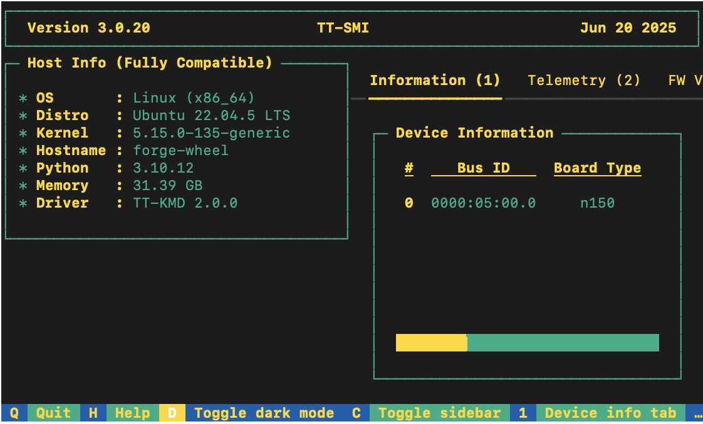

# Getting Started with tt-xla
tt-xla leverages [PJRT](https://github.com/openxla/xla/tree/main/xla/pjrt/c#pjrt---uniform-device-api) to integrate JAX (and in the future other frameworks), [tt-mlir](https://github.com/tenstorrent/tt-mlir) and Tenstorrent hardware. Please see [this](https://opensource.googleblog.com/2023/05/pjrt-simplifying-ml-hardware-and-framework-integration.html) blog post for more information about PJRT project. This project is a fork of [iree-pjrt](https://github.com/stellaraccident/iree-pjrt).

> **Note:** Currently only Tenstorrent `nebula` boards are supported and `galaxy` boards are not yet supported.

# Getting Started
This document walks you through how to set up TT-XLA. TT-XLA is a front end for TT-Forge that is primarily used to ingest JAX models via jit compile, providing a StableHLO (SHLO) graph to the TT-MLIR compiler. TT-XLA leverages [PJRT](https://github.com/openxla/xla/tree/main/xla/pjrt/c#pjrt---uniform-device-api) to integrate JAX, [tt-mlir](https://github.com/tenstorrent/tt-mlir) and Tenstorrent hardware. Please see [this](https://opensource.googleblog.com/2023/05/pjrt-simplifying-ml-hardware-and-framework-integration.html) blog post for more information about PJRT project. This project is a fork of [iree-pjrt](https://github.com/stellaraccident/iree-pjrt). 

This is the main Getting Started page. There are two additional Getting Started pages depending on what you want to do. They are all described here, with links provided to each.

The following topics are covered:

* [Setup Options](#setup-options)
* [Configuring Hardware](#configuring-hardware)
* [Installing a Wheel and Running an Example](#installing-a-wheel-and-running-an-example)
* [Other Setup Options](#other-set-up-options)
   * [Using a Docker Container to Run an Example]
   * [Building From Source]
* [Where to Go Next]

> **NOTE:** If you encounter issues, please request assistance on the
>[TT-XLA Issues](https://github.com/tenstorrent/tt-xla/issues) page.

## Setup Options
TT-XLA can be used to run JAX models on Tenstorrent's AI hardware. Because TT-XLA is open source, you can also develop and add features to it. Setup instructions differ based on the task. You have the following options, listed in order of difficulty: 
* [Installing a Wheel and Running an Example](#installing-a-wheel-and-running-an-example) - You should choose this option if you want to run models.
* [Using a Docker Container to Run an Example](getting_started_docker.md) - Choose this option if you want to keep the environment for running models separate from your existing environment.
* [Building from Source](getting_started_build_from_source.md) - This option is best if you want to develop TT-XLA further. It's a more complex process you are unlikely to need if you want to stick with running a model. 

## Configuring Hardware
Before setup can happen, you must configure your hardware. You can skip this section if you already completed the configuration steps. Otherwise, this section of the walkthrough shows you how to do a quick setup using TT-Installer. 

1. Configure your hardware with TT-Installer using the [Quick Installation section here.](https://docs.tenstorrent.com/getting-started/README.html#quick-installation) 

2. Reboot your machine.

3. Please ensure that after you run this script, after you complete reboot, you activate the virtual environment it sets up - ```source ~/.tenstorrent-venv/bin/activate```.

4. After your environment is running, to check that everything is configured, type the following:

```bash
tt-smi
```

You should see the Tenstorrent System Management Interface. It allows you to view real-time stats, diagnostics, and health info about your Tenstorrent device.



## Installing a Wheel and Running an Example

This section walks you through downloading and installing a wheel. You can install the wheel wherever you would like if it is for running a model. 

1. Make sure you are in an active virtual environment. This walkthrough uses the same environment you activated to look at TT-SMI in the [Configuring Hardware](#configuring-hardware) section. If you are using multiple TT-Forge front ends to run models, you may want to set up a separate virtual environment instead. For example: 

```bash
python3 -m venv .xla-venv
source .xla-venv/bin/activate
```

2. Navigate to the [Tenstorrent Nightly Releases](https://github.com/tenstorrent/tt-forge/releases) page. 

3. TT-XLA requires one wheel for set up, which will start with **tt-xla**. You can also download the source code for everything as a **.zip** or a **tar.gz** file. Scroll through the releases for the latest wheel that starts with **tt-xla**. 

4. When you reach a TT-XLA wheel, look for the **Assets** section and click **Assets**. 

5. Right click on the title of the listed asset. (For TT-XLA, it starts with **pjrt_plugin**.)

6. Download the wheel in your active virtual environment: 

```bash
pip install NAME_OF_WHEEL
```

7. You are now ready to try running a model. Navigate to the section of the [TT-Forge repo that contains TT-XLA demos](https://github.com/tenstorrent/tt-forge/tree/main/demos/tt-xla). 

8. For this walkthrough, the demo int the **gpt2** folder is used. In the **gpt2** folder, in the **requirements.txt** file, you can see that **flax** and **transformers** are necessary to run the demo. Install them: 

```bash
pip install flax transformers
```

9. Download the [**demo.py** file from the **gpt2** folder](https://github.com/tenstorrent/tt-forge/blob/main/demos/tt-xla/gpt2/demo.py) inside your activated virtual environment in a place where you can run it. The demo you are about to run takes a piece of text and tries to predict the next word that logically follows. 

10. If all goes well you should see the prompt "The capital of France is", the predicted next token, the probability it will occur, and a list of other ranked options that could follow instead.

## Other Set up Options
If you want to keep your environment completely separate in a Docker container, or you want to develop TT-XLA further, this section links you to the pages with those options: 

* [Setting up a Docker Container](getting_started_docker.md) 
* [Building from Source]()

## Where to Go Next

Now that you have set up the TT-XLA wheel, you can compile and run other demos. See the [TT-XLA folder in the TT-Forge repo](https://github.com/tenstorrent/tt-forge/tree/main/demos/tt-xla) for other demos you can try.