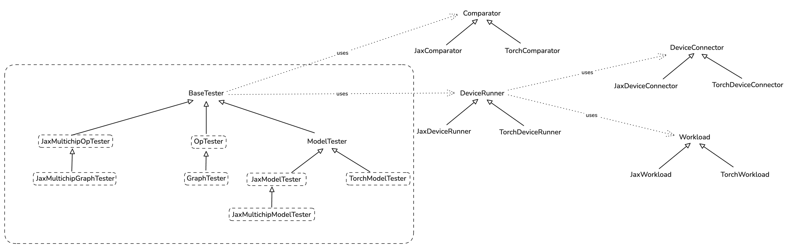

# Test Infra

Test infra consists of main "tester" classes and a few helper ones. Its main goal is making test
writing easy.

Here is a brief class diagram of the infra:



## Op and Graph Tests
Op tester exposes easy to use functions:

```python
run_op_test(...)
run_op_test_with_random_inputs(...)
```

They wrap the instantiation of the `OpTester` and all the underlying complexity. User just need to
pass the op (python function) they want to test to one of these functions like this:

```python
def test_add(x_shape: tuple, y_shape: tuple):
    def add(x: jax.Array, y: jax.Array) -> jax.Array:
        return jnp.add(x, y)

    run_op_test_with_random_inputs(add, [x_shape, y_shape])
```

and that's it.

`GraphTester` is at the moment identical to `OpTester`, and it too exposes

```python
run_graph_test(...)
run_graph_test_with_random_inputs(...)
```

which are meant to be used in the same way as for op tests.

## Model Tests

Models are tested by inheriting one of `*ModelTester` classes and overriding required methods.
Please read docstring of appropriate class you want to inherit for more information.

### Jax Model Example

First, you define a model:

```python
class MNISTMLPModel(nn.Module):
    hidden_sizes: tuple[int]

    @nn.compact
    def __call__(self, x: jax.Array):
        x = x.reshape((x.shape[0], -1))

        for h in self.hidden_sizes:
            x = nn.Dense(features=h)(x)
            x = nn.relu(x)

        x = nn.Dense(features=10)(x)
        x = nn.softmax(x)

        return x
```

Then you define a tester by inheriting `JaxModelTester`:

```python
class MNISTMLPTester(JaxModelTester):
    def __init__(
        self,
        hidden_sizes: Sequence[int],
        comparison_config: ComparisonConfig = ComparisonConfig(),
        run_mode: RunMode = RunMode.INFERENCE,
    ) -> None:
        self._hidden_sizes = hidden_sizes
        super().__init__(comparison_config, run_mode)

    # @override
    def _get_model(self) -> nn.Module:
        return MNISTMLPModel(self._hidden_sizes)

    # @override
    def _get_forward_method_name(self) -> str:
        return "apply"

    # @override
    def _get_input_activations(self) -> Sequence[jax.Array]:
        key = jax.random.PRNGKey(37)
        img = jax.random.normal(key, (4, 28, 28, 1))  # B, H, W, C
        # Channels is 1 as MNIST is in grayscale.
        return img

    # @override
    def _get_forward_method_args(self):
        inp = self._get_input_activations()
        parameters = self._model.init(jax.random.PRNGKey(42), inp)
        return [parameters, inp]
```

Finally, you run the test:

```python
@pytest.fixture
def inference_tester(request) -> MNISTMLPTester:
    return MNISTMLPTester(request.param)

@pytest.mark.parametrize(
    "inference_tester", [(256, 128, 64)], indirect=True, ids=lambda val: f"{val}"
)
def test_mnist_mlp_inference(inference_tester: MNISTMLPTester):
    inference_tester.test()
```

## Serialization and FileCheck

### Serializing IR to Disk

To serialize compilation artifacts (HLO, MLIR IRs) to disk, use the `--serialize` flag:

```bash
pytest path/to/test.py::test_name --serialize
```

Your test must pass the `request` fixture for serialization to work:

**For op/graph tests:**
```python
def test_my_op(request):
    run_op_test(MyOp(), [torch.randn(32, 32)], request=request)
```

**For model tests:**
```python
def test_my_model(model_tester: MyModelTester, request):
    model_tester.test(request=request)
```

Artifacts are written to `output_artifact/<sanitized_test_name>/`.

### Running FileCheck

To verify IR transformations, use the `@pytest.mark.filecheck` decorator:

```python
@pytest.mark.filecheck(["add.ttnn.mlir", "matmul_fusion.ttir.mlir"])
def test_my_op(request):
    run_op_test(MyOp(), [torch.randn(32, 32)], request=request)
```

FileCheck automatically serializes artifacts, runs pattern matching, and fails on mismatches.

**For pattern file syntax and conventions**, see [tests/filecheck/filecheck.md](../../tests/filecheck/filecheck.md).
